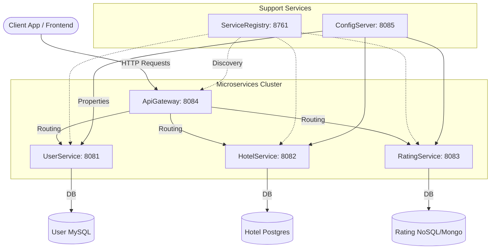

# 🚀 NexCommerce Platform

<div align="center">
  
  
  
  <p><b>A Premium, Modular Commerce Backend Engine</b></p>
</div>

---

## 📖 Overview

The **NexCommerce Platform** has been heavily modernized from a legacy architecture into a portfolio-grade, production-ready Distributed Microservices Engine. It leverages late-stage Java paradigms and the absolute latest Spring Boot 3 standards (including Jakarta EE migrations and RFC 7807 problem details) for peak enterprise readiness.

## ⚡ Key Features & Upgrades
- **Global Rebranding**: Deprecated original traces and standardized under the `com.nexcommerce.*` domain.
- **Spring Boot 3 + Java 17+**: Native support for virtual threads and modernized syntax.
- **Jakarta EE Compliance**: Full migration away from `javax.*`.
- **RBAC Security Engine**: Modern `SecurityFilterChain` Lambda DSL implementing robust Zero-Trust policies.
- **Environment Profiling**: Extracted secrets via 12-Factor App principles using `.env` profiling templates.
- **Infrastructure Abstraction**: Implemented abstract `StorageService` patterns isolating local FS access into swappable components.
- **ProblemDetail Specification**: Replaced crude Maps and DTOs with native RFC 7807 `ProblemDetail` responses.

## 🛠️ Tech Stack

| Component | Technology | Version / Notes |
|---|---|---|
| **Core Framework** | Spring Boot | `3.2.0` |
| **Language** | Java | `17+` |
| **API Gateway** | Spring Cloud Gateway | `2023.0.0` |
| **Service Registry** | Eureka Server | `2023.0.0` |
| **Configuration** | Spring Cloud Config | Centralized External Configuration |
| **Database** | MySQL / PostgreSQL | Configurable per Microservice |
| **Security** | Spring Security / Okta | `oauth2ResourceServer` |
| **API Docs** | Springdoc OpenAPI | Swagger UI alternative for Boot 3 |

---

## 🏗️ Architecture



## 🚀 Quick Start / Local Initialization

### 1. Configure the Environment
Clone the repository and prepare the security/database profiles:
```bash
cp .env.example .env
# Edit .env and supply your local DB credentials and Okta secrets
```

### 2. Startup Databases
Ensure you have MySQL and Postgres instances running locally as required by the application properties, or use Docker:
```bash
docker run -d --name mx-mysql -e MYSQL_ROOT_PASSWORD=root -p 3307:3306 mysql:8
docker run -d --name mx-postgres -e POSTGRES_PASSWORD=root -p 5432:5432 postgres:15
```

### 3. Launch Services
Run the registry and config services first, followed by the domain services:
```bash
./mvnw clean spring-boot:run -pl ServiceRegistry/ServiceRegistry
./mvnw clean spring-boot:run -pl ConfigServer/ConfigServer
./mvnw clean spring-boot:run -pl ApiGateway/ApiGateway
./mvnw clean spring-boot:run -pl UserService/UserService
# etc...
```

---
**Maintained & Upgraded by ShivanshShiv07** | © 2026 NexCommerce Platform
